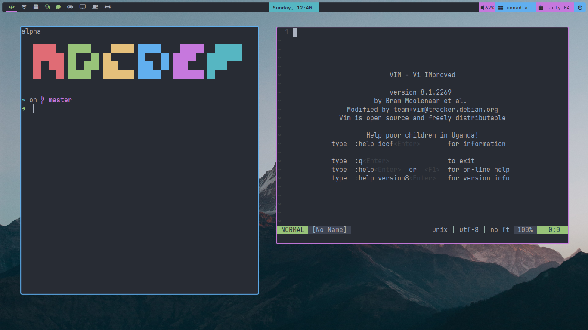

# Woof qtile config
</img>

Yea, yet another qtile user making a dumb config.

**Screenshot**

**Day Wallpaper**

**Night Wallpaper**

## Please follow the steps below before messaging me and being like: I can't install this dum thing

---

For this config to work as intended, you need to have and configure other stuff like autowall (I made that myself haha).

All the needed scripts are located in the `./resources` folder.

after cloning this repo,
make the installer.sh an executable and run the file.

This should install and setup auto-wallpaper as long as this clone is located as `~/.config/qtile`

You also need to install all the fonts located in `./resources/fonts`

and then run `autowall` (you dont have to after a logout)

---
